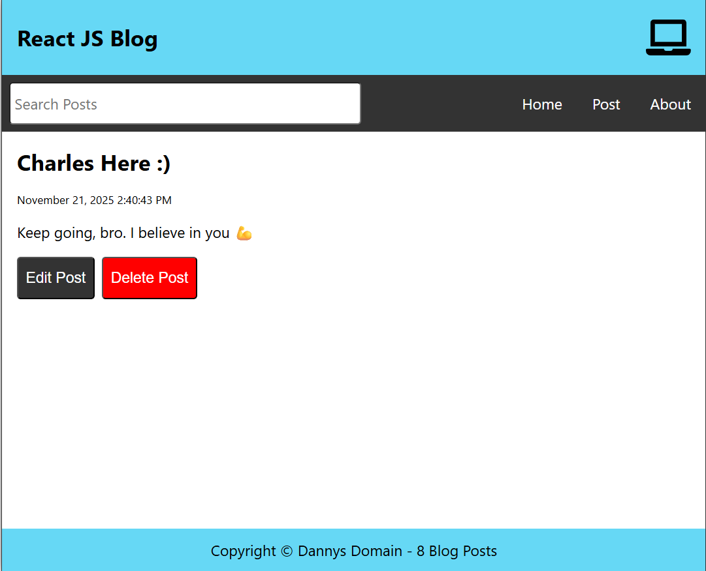

# React Blog Project

This is a react blog project created in a follow-along tutorial by Dave Gray  
My first ever React tutorial infact  
I pushed it to GitHub so I can try deploying to GitHub Pages  
Last time I tried using ```gh-pages``` it didn't work  
Maybe it would this time  
App will be deployed and available on Github Pages [here](https://dannysdomainoriginal.github.io/dev-react-blog/)  

## Project Overview
  
<br>
Features of this Projects are:
1. Add Post
2. Edit Post
3. Delete Post
4. ```localStorage``` persistence achieved using Zustand ```persist``` so app runs without need of a backend server
5. Unique ```localStorage``` key so data never gets overwritten by another app

It's a really nice project overall  
It really had me getting upset here and there by the limitations and restrictions of Zustand and all  
Since it's the state management tool I plan to take on as I continue to grow  
Well as they say
<br>
```
Change what you cannot accept
Accept what you cannot change
```

Bye for now 💖